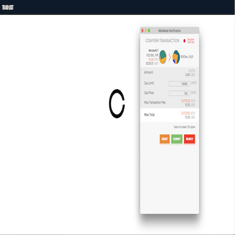

# Ethereum TODO Decentralized application

## Overview
A Simple ToDo DApp build on the Ethereum platform using the Truffle React box.

### Tools used
* Node
* Truffle
* Ganache
* Metamask
* React
* Geth

## Accessing the app running on Ropsten testnet

**Note:** Contract is deployed on Ropsten Testnet at **[0x919D4eB9280c826f7dD89637A9E26d884B2EFa25](https://ropsten.etherscan.io/address/0x919d4eb9280c826f7dd89637a9e26d884b2efa25)** at transaction [0x276b211dda26c58bae90907030fd7d07bcb1956c7878fa0d4dc121f4b2e8f4ee](https://ropsten.etherscan.io/tx/0x276b211dda26c58bae90907030fd7d07bcb1956c7878fa0d4dc121f4b2e8f4ee) deployed through account [0x0e21b8e4e49fa6e9994fa125bcdf0979734774ff](https://ropsten.etherscan.io/address/0x0e21b8e4e49fa6e9994fa125bcdf0979734774ff)

### Pre-requisites

* Ropsten test net ethers
* Metamask

>Load [https://limitless-taiga-87984.herokuapp.com/](https://limitless-taiga-87984.herokuapp.com/) on a browser with Metamask connected to `Ropsten test network`.

**Faucet to get Ropsten test net ethers - https://faucet.bitfwd.xyz/**

## Running the app locally

### Pre-requisites

* Node v9.0 or above
* Truffle v4.0 or above
* Solidity - solc v0.4.19 or above
* Ganache
* Metamask

### Instructions

* Clone this repository and cd into the **eth-todo-dapp** directory

* Test the smart contracts - Run `truffle test --network ganache`

* Deploy the smart contracts - Run `truffle migrate --reset --network ganache`

* Start the React Web DApp - `npm run start`

* Hurray! You can now interact with the DApp

### Geth Scripts

#### Compile contract
```javascript
echo "var todoCompiled=`solc --optimize --combined-json abi,bin,interface todo-dapp/contracts/Todo.sol`;" > todo-dapp/build/scripts/todo.js
```

#### Deploy contract
```javascript
loadScript("todo-dapp/build/scripts/todo.js");
var todoContractAbi = todoCompiled.contracts['Todo.sol:Todo'].abi;
var todoContract = web3.eth.contract(JSON.parse(todoContractAbi));
var todoBinCode = "0x" + todoCompiled.contracts['Todo.sol:Todo'].bin;
personal.unlockAccount(eth.accounts[0], "secret");
var deployTxn = {from: eth.accounts[0], data: todoBinCode, gas : 6700000, gasPrice: web3.toWei("100", "gwei")};
var todoInstance = todoContract.new(deployTxn);
var todoContractAddrs = web3.eth.getTransactionReceipt(todoInstance.transactionHash).contractAddress;
```

#### Interact with Todo contract

##### Add task
```javascript
var todoContractAddrs = "0x919D4eB9280c826f7dD89637A9E26d884B2EFa25";
var todo = todoContract.at(todoContractAddrs);

var taskAddedEvent = todo.LogItemAdded(function(error, result) {
  if (!error){
    var jsonObj = JSON.parse(JSON.stringify(result));
    var argsObj = (jsonObj.args);
    console.log("Item added at " + argsObj.position);
  }
});

personal.unlockAccount(eth.accounts[0], "secret");
var addTask1 = todo.addOrUpdate.sendTransaction(1, "Task Item 1", {from : eth.accounts[0], gas : 6700000, gasPrice: web3.toWei("30", "gwei")});
var txnReceipt1 = web3.eth.getTransactionReceipt(addTask1);

var addTask2 = todo.addOrUpdate.sendTransaction(2, "Task Item 2", {from : eth.accounts[0], gas : 6700000, gasPrice: web3.toWei("30", "gwei")});
var txnReceipt2 = web3.eth.getTransactionReceipt(addTask2);

taskAddedEvent.stopWatching();
```

##### Edit Task
```javascript
var todoContractAddrs = "0x919D4eB9280c826f7dD89637A9E26d884B2EFa25";
var todo = todoContract.at(todoContractAddrs);

var taskEditEvent = todo.LogItemUpdated(function(error, result) {
  if (!error){
    var jsonObj = JSON.parse(JSON.stringify(result));
    var argsObj = (jsonObj.args);
    console.log("Item updated at " + argsObj.position);
  }
});

personal.unlockAccount(eth.accounts[0], "secret");
var updateTask = todo.addOrUpdate.sendTransaction(1, "Edited Task Item 1", {from : eth.accounts[0], gas : 6700000, gasPrice: web3.toWei("30", "gwei")});
var txnReceipt = web3.eth.getTransactionReceipt(updateTask);

taskEditEvent.stopWatching();
```

##### Size of list
```javascript
var todoContractAddrs = "0x919D4eB9280c826f7dD89637A9E26d884B2EFa25";
var todo = todoContract.at(todoContractAddrs);

personal.unlockAccount(eth.accounts[0], "secret");
var sizeOfList = todo.getSize.call({from : eth.accounts[0]});
console.log("Size of list " + sizeOfList);

```

##### Get task item from list
```javascript
var todoContractAddrs = "0xd0dfc1e3fb17620a7486aca80ce27ffa44cd2e64";
var todo = todoContract.at(todoContractAddrs);

personal.unlockAccount(eth.accounts[0], "secret");
var taskValue = todo.getItem.call("1", {from : eth.accounts[0]});
console.log("Task item from todo list " + taskValue);

```

##### Delete Task
```javascript
var todoContractAddrs = "0x919D4eB9280c826f7dD89637A9E26d884B2EFa25";
var todo = todoContract.at(todoContractAddrs);

var taskDeleteEvent = todo.LogItemRemoved(function(error, result) {
  if (!error){
    var jsonObj = JSON.parse(JSON.stringify(result));
    var argsObj = (jsonObj.args);
    console.log("Item deleted at " + argsObj.position);
  }
});

personal.unlockAccount(eth.accounts[0], "secret");
var deleteTask = todo.remove.sendTransaction(1, {from : eth.accounts[0], gas : 6700000, gasPrice: web3.toWei("30", "gwei")});
var txnReceipt = web3.eth.getTransactionReceipt(deleteTask);

taskDeleteEvent.stopWatching();
```

##### Reset List
```javascript
var todoContractAddrs = "0x919D4eB9280c826f7dD89637A9E26d884B2EFa25";
var todo = todoContract.at(todoContractAddrs);

var resetEvent = todo.LogTodoListReset(function(error, result) {
  if (!error){
    var jsonObj = JSON.stringify(result);
    console.log("Event log " + jsonObj);
  }
});

personal.unlockAccount(eth.accounts[0], "secret");
var resetList = todo.deleteTodo.sendTransaction({from : eth.accounts[0], gas : 6700000, gasPrice: web3.toWei("30", "gwei")});
var txnReceipt = web3.eth.getTransactionReceipt(resetList);

resetEvent.stopWatching();
```

### TODO Eth DApp

#### Adding tasks / items to the ToDo list
When interacting with the DApp, any transaction that requires an update to the values in the blockchain will need gas and so Metamask is shown in such scenarios.



When items are added to the list, they are listed with the latest item shown on top.


#### Removing tasks / items from the ToDo list
Items in the list can be removed by clicking on the *X* mark
in the list item.

After *Add Truffle Contract Tests* and *Setup Truffle React module* tasks are deleted


#### Editing tasks / items in the ToDo list
When clicking on an existing row like *Using Truffle build contracts*, inline editing is enabled and the value of the task can be updated inline.


After changing the value, there is a new button with a *tick symbol* which appears and on clicking this, Metamask pops up for confirmation post which the updated value is saved to the blockchain.


#### Resetting the entire ToDo list
On clicking the `Reset List` button the entire list is reset and all the tasks are removed.


### Tasks
* [x] Smart contracts
    * Smart contracts are available in `contracts/` directory
* [x] Tests for Smart contracts
    * Smart contract tests are available in `test/` directory
* [x] React DApp UI
    * React App related files and changes are available in the `src\` directory
* [x] Deploy and test locally
* [x] Deploy and test on Ropsten
